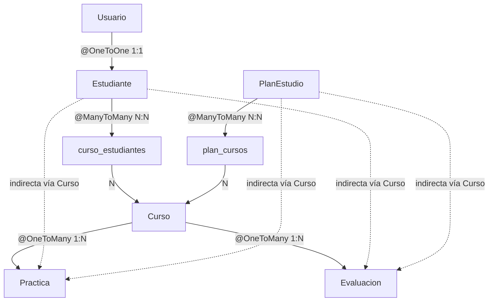

# SpringEduManager — Evaluación Módulo 6 Alkemy

Aplicación web educativa construida con Spring Boot, JPA, Spring Security y REST.
Permite gestionar estudiantes, cursos, prácticas, evaluaciones y planes de estudio
con control de acceso por roles.

---

## Cómo correr el proyecto

```bash
# 1. Clonar / descomprimir el proyecto
# 2. NO necesitas instalar MySQL ni Tomcat — H2 y Tomcat van embebidos

mvn spring-boot:run
# App disponible en: http://localhost:8082
```

**Usuarios de prueba** (se crean automáticamente al arrancar):

| Usuario | Contraseña | Rol        |
|---------|------------|------------|
| admin   | admin123   | ROLE_ADMIN |
| user    | user123    | ROLE_USER  |

---

## Estructura del proyecto

```
springedumanager/
├── pom.xml
├── src/main/
│   ├── java/com/alkemy/springedumanager/
│   │   ├── SpringEduManagerApplication.java
│   │   ├── model/
│   │   │   ├── Estudiante.java
│   │   │   ├── Curso.java
│   │   │   ├── Usuario.java
│   │   │   ├── PlanEstudio.java
│   │   │   ├── Practica.java
│   │   │   └── Evaluacion.java
│   │   ├── repository/
│   │   │   ├── EstudianteRepository.java
│   │   │   ├── CursoRepository.java
│   │   │   ├── UsuarioRepository.java
│   │   │   ├── PlanEstudioRepository.java
│   │   │   ├── PracticaRepository.java
│   │   │   └── EvaluacionRepository.java
│   │   ├── service/
│   │   │   ├── EstudianteService.java
│   │   │   ├── CursoService.java
│   │   │   ├── PlanEstudioService.java
│   │   │   ├── PracticaService.java
│   │   │   └── EvaluacionService.java
│   │   ├── controller/
│   │   │   ├── AuthController.java
│   │   │   ├── EstudianteController.java
│   │   │   ├── CursoController.java
│   │   │   ├── PlanEstudioController.java
│   │   │   ├── PracticaController.java
│   │   │   ├── EvaluacionController.java
│   │   │   ├── UsuarioController.java
│   │   │   └── rest/
│   │   │       ├── EstudianteRestController.java
│   │   │       └── CursoRestController.java
│   │   └── security/
│   │       ├── SecurityConfig.java
│   │       ├── CustomUserDetailsService.java
│   │       └── DataInitializer.java
│   └── resources/
│       ├── application.properties
│       ├── templates/
│       │   ├── auth/
│       │   │   ├── login.html
│       │   │   └── registro.html
│       │   ├── dashboard.html
│       │   ├── cursos/
│       │   │   ├── lista.html
│       │   │   ├── form.html
│       │   │   └── mis-cursos.html
│       │   ├── estudiantes/
│       │   │   ├── lista.html
│       │   │   ├── form.html
│       │   │   ├── vincular.html
│       │   │   └── asignar-plan.html
│       │   ├── planes/
│       │   │   ├── lista.html
│       │   │   ├── form.html
│       │   │   └── cursos.html
│       │   ├── practicas/
│       │   │   ├── lista.html
│       │   │   ├── form.html
│       │   │   └── mis-practicas.html
│       │   ├── evaluaciones/
│       │   │   ├── lista.html
│       │   │   ├── form.html
│       │   │   └── mis-evaluaciones.html
│       │   └── usuarios/
│       │       ├── lista.html
│       │       ├── form.html
│       │       └── reset-password.html
│       └── static/css/estilos.css
```
# Modelo de datos del proyecto

---

## `Usuario`
**Tabla:** `usuarios`

| Campo | Tipo | Restricciones |
|---|---|---|
| id | Long | PK, auto |
| username | String(100) | único, obligatorio |
| password | String | obligatorio — hash BCrypt |
| rol | String(30) | obligatorio — `ROLE_ADMIN` / `ROLE_USER` |
| activo | boolean | default `true` |
| estudiante | Estudiante | `@OneToOne` — null si es ADMIN |

---

## `Estudiante`
**Tabla:** `estudiantes`

| Campo | Tipo | Restricciones |
|---|---|---|
| id | Long | PK, auto |
| nombre | String(100) | obligatorio |
| apellido | String(100) | obligatorio |
| rut | String(12) | único, obligatorio |
| fechaNacimiento | LocalDate | obligatorio |
| edad | int | `@Transient` — calculado desde fechaNacimiento |
| direccion | String(250) | opcional — núcleo de convivencia |
| nivelMineduc | String(20) | obligatorio — `1° Básico` ... `4° Medio` |
| seccion | String(1) | obligatorio — `A / B / C / D / E` |
| activo | boolean | default `true` |

### Apoderado principal

| Campo | Tipo | Restricciones |
|---|---|---|
| nombreApoderado | String(150) | obligatorio |
| vinculoApoderado | String(60) | obligatorio — Madre, Padre, Tutor legal, etc. |
| emailApoderado | String(150) | obligatorio, formato email |
| telefonoApoderado | String(20) | opcional |
| apoderadoMismaDireccion | boolean | `true` → comparte núcleo con estudiante |
| direccionApoderado | String(250) | solo si `apoderadoMismaDireccion = false` |

### Apoderado suplente

| Campo | Tipo | Restricciones |
|---|---|---|
| nombreApoderadoSuplente | String(150) | opcional |
| vinculoApoderadoSuplente | String(60) | opcional |
| emailApoderadoSuplente | String(150) | opcional, formato email |
| telefonoApoderadoSuplente | String(20) | opcional |
| suplenteMismaDireccionEstudiante | boolean | `true` → comparte núcleo con estudiante |
| suplenteMismaDireccionPrincipal | boolean | `true` → comparte núcleo con apoderado principal |
| direccionApoderadoSuplente | String(250) | solo si ambos flags son `false` |

### Relaciones

| Campo   | Tipo         | Restricciones                    |
|---------|--------------|----------------------------------|
| usuario | Usuario      | `@OneToOne` inverso — mappedBy   |
| cursos  | Set\<Curso\> | `@ManyToMany` inverso — mappedBy |

---

## Modelo de datos
```Mermaid
erDiagram
    Usuario {
        string username
        string password
        string rol
        boolean activo
    }
    Estudiante {
        string rut
        string nombre
        string nivel
        string apoderados
    }
    Curso {
        string nombre
        int duracionHoras
        boolean activo
    }
    PlanEstudio {
        string nombre
        string nivel
        int anio
        boolean activo
    }
    Practica {
        string nombre
        string estado
        double nota
        date fecha
    }
    Evaluacion {
        string nombre
        string tipo
        double nota
        date fecha
    }

    Usuario ||--|| Estudiante : "@OneToOne"
    Estudiante }|--|{ Curso : "curso_estudiantes"
    PlanEstudio }|--|{ Curso : "plan_cursos"
    Curso ||--o{ Practica : "@OneToMany"
    Curso ||--o{ Evaluacion : "@OneToMany"
    Estudiante ||--o{ Practica : "@OneToMany"
    Estudiante ||--o{ Evaluacion : "@OneToMany"
```


## `Curso`
**Tabla:** `cursos` + tabla intermedia `curso_estudiantes(curso_id, estudiante_id)`

| Campo | Tipo | Restricciones |
|---|---|---|
| id | Long | PK, auto |
| nombre | String(150) | obligatorio |
| descripcion | String(500) | opcional |
| duracionHoras | Integer | obligatorio |
| activo | boolean | default `true` |
| estudiantes | Set\<Estudiante\> | `@ManyToMany` dueño — tabla `curso_estudiantes` |
| planesEstudio | Set\<PlanEstudio\> | `@ManyToMany` inverso — mappedBy |

---

## `PlanEstudio`
**Tabla:** `planes_estudio` + tabla intermedia `plan_cursos(plan_id, curso_id)`

| Campo | Tipo | Restricciones |
|---|---|---|
| id | Long | PK, auto |
| nombre | String(150) | obligatorio — Ej: `"Plan 1° Básico 2026"` |
| nivelMineduc | String(20) | obligatorio — `1° Básico` ... `4° Medio` |
| anio | Integer | obligatorio |
| descripcion | String(500) | opcional |
| activo | boolean | default `true` |
| cursos | Set\<Curso\> | `@ManyToMany` dueño — tabla `plan_cursos` `EAGER` |

---

## `Practica`
**Tabla:** `practicas`

| Campo | Tipo | Restricciones |
|---|---|---|
| id | Long | PK, auto |
| nombre | String(150) | obligatorio |
| descripcion | String(500) | opcional |
| fechaEntrega | LocalDate | obligatorio |
| estado | EstadoPractica | default `PENDIENTE` — `PENDIENTE / ENTREGADA / NO_ENTREGADA / CORREGIDA` |
| nota | Double | opcional — 1.0 a 7.0, solo cuando `CORREGIDA` |
| aprobado | boolean | `@Transient` — `nota >= 4.0` |
| curso | Curso | `@ManyToOne` obligatorio |
| estudiante | Estudiante | `@ManyToOne` obligatorio |

---

## `Evaluacion`
**Tabla:** `evaluaciones`

| Campo       | Tipo           | Restricciones            |
|-------------|----------------|--------------------------|
| id          | Long           | PK, auto                 |
| nombre      | String(150)    | obligatorio              |
| descripcion | String(500)    | opcional                 |
| nota        | Double         | obligatorio — 1.0 a 7.0  |
| fecha       | LocalDate      | obligatorio              |
| tipo        | TipoEvaluacion | default `PRUEBA` — `TRABAJO / CONTROL / PRUEBA / DISERTACION / PROYECTO / EVALUACION` |
| aprobado    | boolean        | `@Transient` — `nota >= 4.0` |
| curso       | Curso          | `@ManyToOne` obligatorio |
| estudiante  | Estudiante     | `@ManyToOne` obligatorio |
---

## Relaciones entre entidades



## Gestión de Maven

```bash
mvn clean          # limpia archivos compilados
mvn install        # compila, testea y empaqueta
mvn package        # genera el JAR ejecutable
mvn spring-boot:run  # levanta la app directo
```

---

## Arquitectura MVC

El proyecto sigue el patrón **Model — View — Controller**:

- **Model** (`model/`) — entidades JPA que Hibernate mapea a tablas
- **View** (`templates/`) — páginas Thymeleaf que reemplazan JSP/JSTL
- **Controller** (`controller/`) — reciben requests HTTP, llaman al servicio y devuelven la vista

La capa **Service** (`service/`) concentra la lógica de negocio, separada del controller. 
Los **Repository** (`repository/`) extienden `JpaRepository` y generan queries automáticamente por convención de nombres.

---

## Persistencia con JPA

- Base de datos **H2 embebida** en memoria para desarrollo — no requiere instalación
- Hibernate crea las tablas automáticamente desde las anotaciones `@Entity`
- Relaciones implementadas: `@OneToOne`, `@ManyToOne`, `@ManyToMany`
- Consola H2 disponible en `http://localhost:8082/h2-console` mientras la app está corriendo

**Credenciales H2:**
- JDBC URL: `jdbc:h2:mem:edudb`
- User: `sa` — Password: (vacío)

---

## Seguridad con Spring Security

- Roles: `ROLE_ADMIN` y `ROLE_USER`
- Protección de rutas en `SecurityConfig` con `requestMatchers().hasRole()`
- Protección a nivel de método con `@PreAuthorize("hasRole('ADMIN')")`
- Contraseñas hasheadas con **BCrypt** (factor 12)
- Formulario de login en `/login` y logout por POST en `/logout`
- Auto-registro público en `/registro` — crea cuenta básica de estudiante

| Ruta                          | Acceso      |
|-------------------------------|-------------|
| `/login`, `/registro`         | Público     |
| `/cursos`, `/estudiantes`     | Autenticado |
| `/cursos/nuevo`, `/editar/**` | Solo ADMIN  |
| `/usuarios/**`                | Solo ADMIN  |
| `/api/**`                     | Autenticado |

---

## API REST

| Método | URL                     | Auth           |
|--------|-------------------------|----------------|
| GET    | `/api/estudiantes`      | cualquier user |
| GET    | `/api/estudiantes/{id}` | cualquier user |
| POST   | `/api/estudiantes`      | solo ADMIN     |
| PUT    | `/api/estudiantes/{id}` | solo ADMIN     |
| DELETE | `/api/estudiantes/{id}` | solo ADMIN     |
| GET    | `/api/cursos`           | cualquier user |
| GET    | `/api/cursos/{id}`      | cualquier user |
| POST   | `/api/cursos`           | solo ADMIN     |
| PUT    | `/api/cursos/{id}`      | solo ADMIN     |
| DELETE | `/api/cursos/{id}`      | solo ADMIN     |

**Configurar Postman:** Authorization → Basic Auth → `admin` / `admin123`

Body para POST `/api/cursos` (raw JSON):
```json
{
  "nombre": "Matemáticas 1",
  "descripcion": "Aritmética y geometría básica",
  "duracionHoras": 228,
  "activo": true
}
```

---

## Cambiar a H2 (desarrollo)

En `application.properties`, comenta el bloque MySQL y descomenta el bloque H2:
```properties
# ── Base de datos H2 ──────────────────────────────────────────
spring.datasource.url=jdbc:h2:mem:edudb;DB_CLOSE_DELAY=-1
spring.datasource.driver-class-name=org.h2.Driver
spring.datasource.username=sa
spring.datasource.password=

spring.h2.console.enabled=true
spring.h2.console.path=/h2-console

spring.jpa.hibernate.ddl-auto=create-drop
```
Con `create-drop` Hibernate recrea las tablas cada vez que arranca la app y las elimina al cerrarla — los datos no persisten entre reinicios. La consola H2 queda disponible en `http://localhost:8082/h2-console` con JDBC URL `jdbc:h2:mem:edudb`, usuario `sa` y contraseña vacía.

### Opciones para exportar H2
Opciones para exportar H2

## 1. Script SQL (más común)
Desde la consola H2 o JDBC, puedes usar el comando SCRIPT:
sqlSCRIPT TO 'ruta/backup.sql';
Esto genera un archivo SQL con toda la estructura y los datos. Para restaurarlo:
sqlRUNSCRIPT FROM 'ruta/backup.sql';

## 2. Copiar el archivo .mv.db directamente
Si usas H2 en modo archivo (no en memoria), simplemente copia el archivo nombredb.mv.db. Es el enfoque más simple para backups.

## 3. Exportar a CSV
Para exportar tablas individuales:
    sqlCALL CSVWRITE('ruta/tabla.csv', 'SELECT * FROM mi_tabla');
## 4. Herramienta de línea de comandos
bashjava -cp h2.jar org.h2.tools.Script \
  - url "jdbc:h2:./mibase" \
  - user sa \
  - password "" \
  - script backup.sql
## 5. Migrar a otra base de datos
Si quieres pasar los datos a PostgreSQL, MySQL, etc., puedes usar herramientas como:
  - Flyway o Liquibase para migrar scripts
  - DBeaver (interfaz gráfica) que permite exportar e importar entre motores distintos


## Cambiar a MySQL (opcional)

En `application.properties`, comenta el bloque H2 y descomenta el bloque MySQL.
Cambia `ddl-auto=create-drop` a `ddl-auto=update`.

---

## Tecnologías

| Tecnología                  | Versión |
|-----------------------------|---------|
| Java                        | 21      |
| Spring Boot                 | 4.0.5   |
| Spring MVC + Thymeleaf      | —       |
| Spring Data JPA + Hibernate | —       |
| Spring Security + BCrypt    | —       |
| H2 (dev) / MySQL (prod)     | —       |
| Maven                       | 3.9+    |
| Lombok                      | —       |
